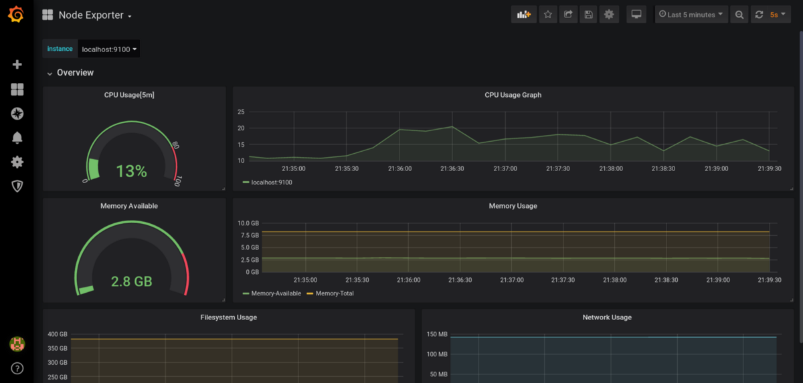
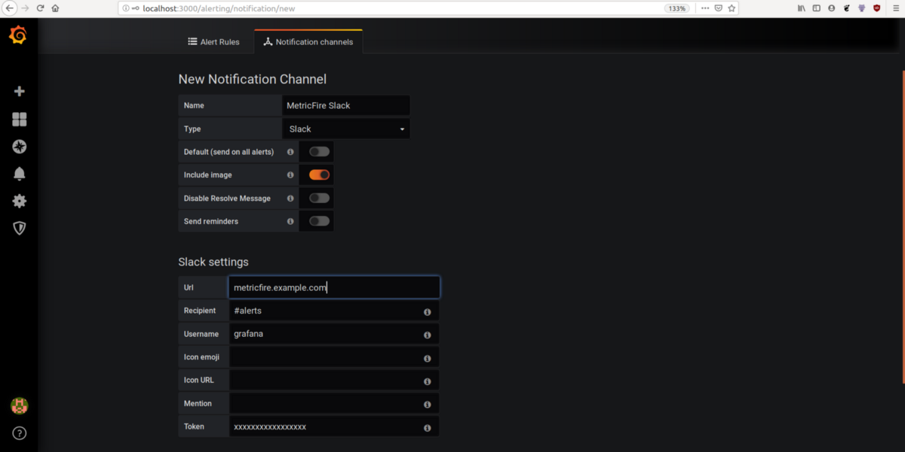

Grafana
==
## introduction
Les tableaux de bord Grafana sont une partie importante de l'infrastructure et de l'instrumentation des applications. Grafana est l'un des outils de tableau de bord et de visualisation les plus populaires pour les métriques. Dans cet article, nous allons approfondir les tableaux de bord Grafana. Nous allons créer un tableau de bord Grafana pour les métriques les plus importantes d'une VM, apprendre à créer des tableaux de bord avancés avec des filtres pour plusieurs métriques d'instance, importer et exporter des tableaux de bord, apprendre à actualiser les intervalles dans les tableaux de bord et en savoir plus sur les plugins.

Pour commencer, nous aurons besoin d'une source de métriques à partir de laquelle nous ajouterons des métriques à Grafana pour la visualisation. Nous utiliserons Prometheus comme source de données et exportateur de nœuds pour exporter les métriques d'une VM vers Grafana. Si vous souhaitez suivre votre propre configuration, nous vous suggérons de vous connecter à l' essai gratuit de MetricFire . Vous pouvez configurer vos propres tableaux de bord Grafana directement dans notre plateforme et appliquer ce que vous apprenez de cet article.

## Install Grafana
```
sudo apt-get install -y adduser libfontconfig1
wget https://dl.grafana.com/oss/release/grafana_7.4.1_amd64.deb
sudo dpkg -i grafana_7.4.1_amd64.deb
```

## Ajouter une source de données
Grafana prend en charge différents storage backends qui offrent une variété de
façons d'interroger et de visualiser les données.
Toutes ces sources de données exposent leurs propres langages de requête.
Par exemple, Prometheus expose PromQL pour les données de séries chronologiques
et la source de données MySQL expose le langage de requête SQL.
Ajoutons maintenant Prometheus comme source de données dans Grafana .

* Allez dans configuration → data sources et cliquez sur “Add data source”.

* Ajoutez Prometheus et remplissez l'url, l'authentification,
l'intervalle de récupération et le nom de la source de données.
* Appuyez sur enregistrer et tester.

Il devrait indiquer que la source de données fonctionne si
Grafana se connecte avec succès à Prometheus.

Un détail important à noter est le “access mode drop down”,
qui propose deux options: serveur et navigateur.
L'option serveur signifie que toute demande adressée à une source de données
sera envoyée au serveur backend Grafana, et le backend enverra la demande
à la source de données.
L'option de navigateur signifie que les demandes à la source de données
seront envoyées directement à la source de données.
L'option serveur est recommandée pour un accès sécurisé afin de ne pas exposer
les informations d'identification à tous les utilisateurs. Maintenant que nous
avons configuré une source de données, visualisons les métriques d'une VM.

## Creating dashboards

Un tableau de bord est un groupe de widgets, mais il fournit également beaucoup
plus de fonctionnalités telles que des dossiers, des variables (pour changer
les visualisations dans les widgets), des plages de temps et une actualisation
automatique des widgets. Accédez à l'icône plus sur le côté gauche de la page
d'accueil et créez un tableau de bord avec le nom «Nodes Metrics».

### Adding a row
Une ligne est un séparateur logique dans un tableau de bord qui peut être utilisé
pour regrouper les panneaux. Une ligne peut être créée dynamiquement à l'aide de
variables. Nous parlerons des variables dans la section suivante.

* Click on the + icon (the first icon on the top right) and click on “convert to row”.
* Une fois la nouvelle ligne ajoutée, cliquez sur l'icône des paramètres de la ligne,
cela devrait ouvrir une fenêtre contextuelle d'édition.
* Créez une ligne nommée "Overview". Nous ajouterons des métriques de base telles que
la mémoire, le processeur, l'utilisation du réseau, etc.

### Ajouter des variables

Les variables sont un moyen de créer des tableaux de bord Grafana dynamiques.
Ils peuvent être utilisés pour sélectionner différentes instances de métriques.
Par exemple, si vous recevez des métriques de plusieurs machines,
des variables peuvent être utilisées pour créer des listes déroulantes pour
sélectionner les métriques d'une machine. Ces variables sont utilisées dans la
requête de source de données pour prendre en charge les modifications des métriques
dans le tableau de bord.
Ajoutons une variable pour les noms de VM afin que nous puissions sélectionner
des métriques pour différentes VM.

Les variables peuvent être de différents types, tels que:

- Type de source de données: qui peut être utilisé pour changer dynamiquement la source de données dans les panneaux.
- Type de requête: où les valeurs telles que les noms d'instance et les hôtes du serveur peuvent être récupérées.
- Type d'intervalle: qui peut être utilisé pour effectuer une agrégation de manière dynamique sur les requêtes telles que l'utilisation du processeur et de la mémoire, de sorte que les derniers 1m, 5m, 10m peuvent être vus en utilisant des variables sans panneaux supplémentaires.

Go to dashboard settings in the top right and click on variables → add new variable.

Sélectionnez le type de requête et ajoutez la requête pour obtenir tous
les noms d'hôte de l'exportateur de nœuds, que nous pouvons utiliser pour
voir différentes statistiques de VM.

## Ajout de visualisation
Un panneau est le bloc de base de la visualisation dans Grafana.
Il existe de nombreuses visualisations telles que
Graph, Singlestat, Dashlist, Table, Text et plus encore si vous envisagez des plugins.
Mais avant de créer ces visualisations, parlons de ce que nous voulons surveiller
et des panneaux que nous utiliserons pour les visualisations.

Les mesures que vous choisissez de surveiller doivent répondre à deux questions:
qu'est-ce qui est cassé et pourquoi?

Puisque nous voulons surveiller une machine virtuelle, nous devrons surveiller
les métriques de base telles que le processeur, la mémoire, le réseau, les E/S disque,
l'espace disque, la disponibilité et le nombre de processus en cours d'exécution.

Si nous surveillions une application Web, nous voudrions surveiller le nombre de
demandes entrantes, les temps de réponse, les codes de réponse, les ressources
utilisées pour traiter une seule demande, les demandes en file d'attente et rejetées, etc.

Ajoutons maintenant quelques visualisations. Je vais expliquer quels panneaux
utiliser pour surveiller les métriques: CPU, mémoire, système de fichiers, réseau.

1. CPU: Nous voulons voir l'utilisation actuelle du processeur et les heures
supplémentaires d'utilisation du processeur. Pour voir l'utilisation actuelle
du processeur, nous utiliserons la visualisation de type jauge. Une jauge est
comme un compteur de vitesse, elle montera ou descendra dans une plage spécifique.
Ajoutez un nouveau panneau et cliquez sur Ajouter une requête sur le panneau.


* Le volet de droite affiche trois onglets.
Dans l'onglet "Panel", Accédez à Visualisation et sélectionnez Gauge.

* Sous `Display`, pour «Show», sélectionnez *Calculate*.
* Pour *Calculate*, choisissez *Last* car nous voulons voir le dernier statut.
* Dans l'onglet "Field" , sous "Standard Options", pour l'unité,
sélectionnez le pourcentage (il existe de nombreux autres champs disponibles tels que KBps, miles, etc.)
* Sous "Threshold", choisissez la valeur au-dessus de laquelle vous souhaitez
afficher le rouge. Dans le cas ci-dessus, tout ce qui dépasse 80% d'utilisation
du processeur sera affiché en rouge.

Pour visualiser les données, nous utiliserons `irate()` de node_CPU (utilisation moyenne du processeur), pour un intervalle de 5m, avec la variable d'instance comme instance=~"$instance".
Lorsque nous modifions l'instance à l'aide du menu déroulant, les mesures du panneau changent automatiquement.
```
100 - (avg(irate(node_cpu_seconds_total{mode="idle", instance=~"$instance"}[5m]))*100)
```
* L'onglet Panel peut être utilisé pour modifier le titre du panneau,
la description, les liens, etc. Ajoutons maintenant le titre en tant que `CPU Usage [5m]`.

- Ajoutons le graphique chronologique de l'utilisation du processeur.
Créez un nouveau panneau, ajoutez une requête et sélectionnez le type de visualisation
sous forme de graphique dans l'onglet de visualisation.
Il existe de nombreuses options pour les types de graphiques tels que les graphiques à barres, les points, l'empilement, la largeur de ligne, les unités d'axe, la taille de l'échantillon, etc.

Grafana calcule automatiquement la durée des intervalles de temps dans chaque graphique. Il utilise les variables $ _interval, $ _from et $ _to. Par exemple, si vous visualisez les 6 derniers mois de données, il affichera des segments d'intervalle d'un jour dans le graphique, tandis que si vous visualisez les données de la dernière heure, il s'affichera dans des groupes d'intervalle de 1 m.

Maintenant que nous avons des visualisations de métriques CPU, ajoutons quelques métriques supplémentaires.

2. Memory
ajoutons une visualisation de la mémoire totale et de l'utilisation actuelle de la mémoire. Nous ajouterons cette fois plusieurs requêtes pour visualiser la mémoire disponible et la mémoire totale.
```
node_memory_MemAvailable_bytes{instance="$instance"}/1024/1024/1024
node_memory_MemTotal_bytes{instance="$instance"}/1024/1024/1024
```
Ajouter un jauge pour la mémoire utilisé:
```
(node_memory_MemTotal_bytes{instance="$instance"}  - node_memory_MemAvailable_bytes{instance="$instance"} ) / node_memory_MemTotal_bytes{instance="$instance"} *100
```
3. Système de fichiers:
Nous ajouterons le graphique de l'espace disque libre par rapport à l'espace disque total. Nous avons sélectionné les métriques filesystem_free et filesystem_size respectivement pour ce graphique. Ici, nous avons sélectionné le point de montage comme / pour visualiser les métriques pour le système de fichiers complet.
```
node_filesystem_free_bytes{instance="$instance", mountpoint="/"}
node_filesystem_size_bytes{instance="$instance", mountpoint="/"}
```
Précisez la légende comme: free {{ mountpoint }} et total {{ mountpoint }}

4. Réseau:
dans cet exemple, nous visualisons la taille des données reçues et transmises sur différentes interfaces réseau. Ici, nous configurons l'unité de l'axe y en mégaoctets, mais elle peut être modifiée dans l'onglet visualisations en gigaoctets ou téraoctets (c'est beaucoup de trafic).
```
rate(node_network_receive_bytes_total{instance="$instance"}[1m])
rate(node_network_transmit_bytes_total{instance="$instance"}[1m])
```
Précisez la légende comme: Received {{ device }} et Sent {{ device }}

Faites maintenant glisser toutes les visualisations ajoutées vers le Row.




## Intervalles de temps et actualisation automatique
Grafana fournit des intervalles de temps afin que nous puissions vérifier
les métriques à un moment donné ou sur un intervalle de temps.
Dans le coin supérieur droit, vous pouvez voir le menu déroulant où vous pouvez
définir l'intervalle de temps pour les données. Il y en a quelques-uns habituels
comme les 5 dernières minutes, la dernière heure, les 12 dernières heures et des
intervalles de temps personnalisés pour n'importe quelle date ou heure.

L'actualisation automatique peut être utilisée pour actualiser les données à des
intervalles de temps spécifiques comme toutes les 5s, tous les 1m, etc.

# Alerte
La visualisation des métriques est vraiment utile mais personne ne peut rester
assis devant un ordinateur à regarder un tableau de bord toute la journée !!!
Les alertes peuvent nous informer de mesures critiques telles qu'une utilisation
élevée de la mémoire.

Configurons une alerte Slack sur le tableau de bord que nous venons de créer
pour nous alerter si l'utilisation du processeur est élevée.
Cliquez sur Alerte sur la page d'accueil et accédez aux canaux de notification
et ajoutez un nouveau canal de notification pour Slack. Il nécessite des
informations d'identification, un nom de canal et un nom d'utilisateur slack.


[Visitez ce lien pour lier Slack à Grafana](https://medium.com/@_oleksii_/grafana-alerting-and-slack-notifications-3affe9d5f688)

Après avoir configuré une destination d'alerte, nous allons accéder à l'icône
d'alerte du panneau pour configurer les alertes.
Nous allons configurer la condition suivante:
si la valeur moyenne d'utilisation du processeur dans une plage de temps de 5m est supérieure à 90, l'alerte sera déclenchée.
Nous sélectionnons également où ces alertes doivent être envoyées, ici nous utilisons Slack que nous venons d'ajouter.
Cette alerte est évaluée toutes les 1m. Si aucune donnée n'est disponible,
nous configurons l'état sur alerte, ce qui signifie qu'il déclenchera l'alerte
si aucune donnée n'est disponible.


Nous avons donc maintenant un tableau de bord fonctionnel et une configuration d'alerte.

# Importation et exportation de tableaux de bord
Chaque tableau de bord de Grafana est basé sur JSON. Ces tableaux de bord peuvent être exportés à partir d'un fichier JSON ou du référentiel de tableaux de bord Grafana .

Exportons le tableau de bord que nous venons de créer. Allez dans dashboard setting → JSON Model, il affiche un document JSON. Ce document JSON est une définition de tableau de bord complète qui peut être importée dans n'importe quelle autre instance Grafana. Sauvegardons-le sous node-exporter.json.


Voyons maintenant comment nous pouvons importer un tableau de bord. Accédez à l'icône + en haut à gauche et cliquez sur importer. Le JSON que nous avons créé ci-dessus peut être collé ci-dessous pour être importé, ou nous pouvons coller l'ID du tableau de bord à partir du référentiel de tableau de bord Grafana , et il sera importé.


Pour dupliquer un tableau de bord, accédez aux paramètres et enregistrez-le sous un nom différent et vous obtiendrez un tableau de bord en double.

# Plugins
Les plugins offrent un moyen d'étendre Grafana au-delà de ses fonctionnalités étonnantes afin que nous puissions obtenir de nouvelles sources de données, panneaux, types de tableaux de bord, etc.

## Installer des plugins
Les plugins peuvent être installés à l'aide de Grafana CLI. Accédez au référentiel de plugins grafana et recherchez le plugin dont vous avez besoin, puis accédez à l'onglet d'installation pour voir l'identifiant du plugin (également disponible dans le chemin de l'URL).
Pour installer un plugin, procédez comme suit.
```
‍grafana-cli plugins install <plugin-id>
```

Redémarrez le serveur Grafana.
```
Sudo service grafana-server restart.
```

Vous pouvez lister le plugin installé à l'aide de la commande suivante et vérifier qu'il est installé avec succès.
```
grafana-cli plugins ls
```

Si le plugin n'est pas disponible sur le référentiel de plugin Grafana, il peut être installé à partir d'une URL personnalisée ou d'un chemin local par exemple.
```
grafana-cli --pluginUrl https://plugins.example.com/grafana/plugins/<plugin-id>-<plugin-version>.zip plugins install <plugin-id>
```

## Quelques plugins et tableaux de bord importants
WorldPing: surveillez la disponibilité des applications Internet.
Azure Monitor: la source de données pour les insights du moniteur Azure.
PagerDuty: source de données Pagerduty
Plotly: Plotly est un cadre de visualisation de données, le plugin Plotly offre un ensemble puissant de panneaux de visualisation.
Kubernetes: cette application affiche toutes les métriques collectées par Prometheus sur les clusters kubernetes, dans un tableau de bord prédéfini.
